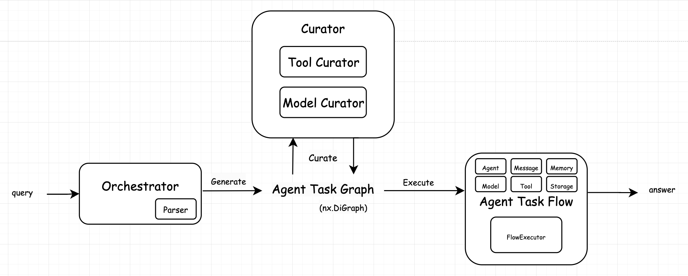

# MAS

## Quick Start

- setup

```bash
$ pip install -r requirements.txt
```

- examples

```bash
$ python experiments/example_factory.py
$ python experiments/example_all.py
$ pytest
```

## Usage
```python
from dotenv import load_dotenv
load_dotenv()

import logging
logging.basicConfig(level=logging.INFO)

from mas.mas import MasFactory
from mas.orch import MockOrch
from mas.curator import ModelCurator, ToolCurator
from mas.flow import PocketflowExecutor
from mas.agent import MockAgent, AgnoAgent

logger = logging.getLogger(__name__)

mas = MasFactory(
    cls_Orch=MockOrch,
    cls_Executor=PocketflowExecutor,
    cls_Agent=MockAgent,
    cls_Curators=[ModelCurator, ToolCurator],
)
mas.build()
mas.run("Write a story in George R.R. Martin's style")
```

### Adding Tools
We provide 2 ways to add tools to the tool pool:
1. Register as a tool function, using the `@ToolPool.register` decorator
```python
from mas.tool.pool import ToolPool

@ToolPool.register(
    name="echo",
    description="simply echo the input"
)
def echo(query: str) -> str:
    return query
```
2. Register as a tool instance, using the `ToolPool.register` function
```python
from agno.tools.duckduckgo import DuckDuckGoTools
from mas.tool.pool import ToolPool

ToolPool.register(
    name="duckduckgo",
    description="web search through duckduckgo"
)(DuckDuckGoTools())
```

> hint: To test your tool, use `pytest tests/test_tool.py -s`

### Adding Models
Register using the `@ModelPool.register` decorator
```python
from agno.models.google.gemini import Gemini
from mas.model.pool import ModelPool

@ModelPool.register(name="gemini", description="Gemini")
class TestModel(Gemini):
    pass
```

> hint: To test your tool, use `pytest tests/test_model.py -s`

## Introduction


MAS is a framework for building autonomous multi-agent systems (MAS).

"The less, the better."

MAS is designed to be modular and extensible, almost all components are pluggable.

**Key features:**
- Separating *Execution Flow* from *Agent Task Graph*:
  - allowing flexible control over the execution style
- Separating *Curation* from *Orchestration*, allowing orchestrator focus on the task graph generation, while curators focus on resolving the specific agent settings
- Multi-modality:
  - supporting image, video, audio, file, etc.
  - supporting modality validation over the graph
- Shared memory:
  - the global execution trace is available among all agents
- Minimum fixed interface:
  - AgentTaskGraph, AgentTaskFlow, Message, Flow Memory are fixed structure, capturing the minimum yet critical interfaces to modeling the MAS problem.
  - Others are customizable or modularized, allowing you to leverage any existing frameworks or implement your own.

**Modularized components:**
- Modularized *Orchestrator*:
  - you can implement your own orchestrator, with different graph generation strategies
- Modularized *Flow Executor*: 
  - you can use any workflow-style framework, e.g. Pocketflow etc.
  - you can also implement your own executor, e.g. simple chain executor
- Modularized *Agent*: 
  - you can use any agent framework, e.g. LangChain, Agno (default) etc.
- Customizable *Flow Memory Data*:
  - the flow memory is a map between "(executed) edge" and "data"
  - "data" is a customizable dict
- Modularized *Tool* and *Base Model*:
  - you can implement your own tool and base model, simply by adding to the maps.
- Modularized *Curator*:
  - you can implement your own curator, with different curation strategies
- Modularized *Parser*:
  - customize it to allow parsing arbitrary LLM orchestrator output format
- Modularized *Storage*:
  - you can use any storage to store the flow memory, e.g. InMemoryStorage, RedisStorage, SQLiteStorage etc.

## What's in the box

- Orchestrator: Responsible for generating the agent task graph
  - MockOrch: Mock orchestrator
  - LLMOrch: LLM orchestrator
- Parser: Responsible for parsing the agent task graph from raw formats
  - YamlParser: YAML parser
- AgentTaskGraph:
  - modality validation
- AgentTaskFlow: separating graph with execution flow
  - FlowExecutor: can use any workflow-style framework
    - SimpleSequentialExecutor: simple for loop execution
    - PocketflowExecutor
- Memory: shared memory between agents
- Message: message definition
- Agent: the agent class, can use any framework
  - MockAgent: Mock agent simple fix-answer agent for test
  - AgnoAgent: "Agno" framework agent
- Tool:
  - extent any tool by implementing the Agno's Toolkit interface, and add to TOOLS
- Model:
  - extent any model by implementing the Agno's Model interface, and add to MODELS
- Storage: pluggable storage
  - InMemoryStorage: In-memory storage
  - RedisStorage: Redis storage
  - SqliteStorage: SQLite storage

## TODO

- [X] implement LLM-based orchestrators
- [ ] add enough tools
- [ ] add enough models
- [ ] async flow executor to better support branching-flow
- [ ] test multi-modality
- [ ] test different storage
- [ ] support fix-workflow agents?
- [ ] stream output
